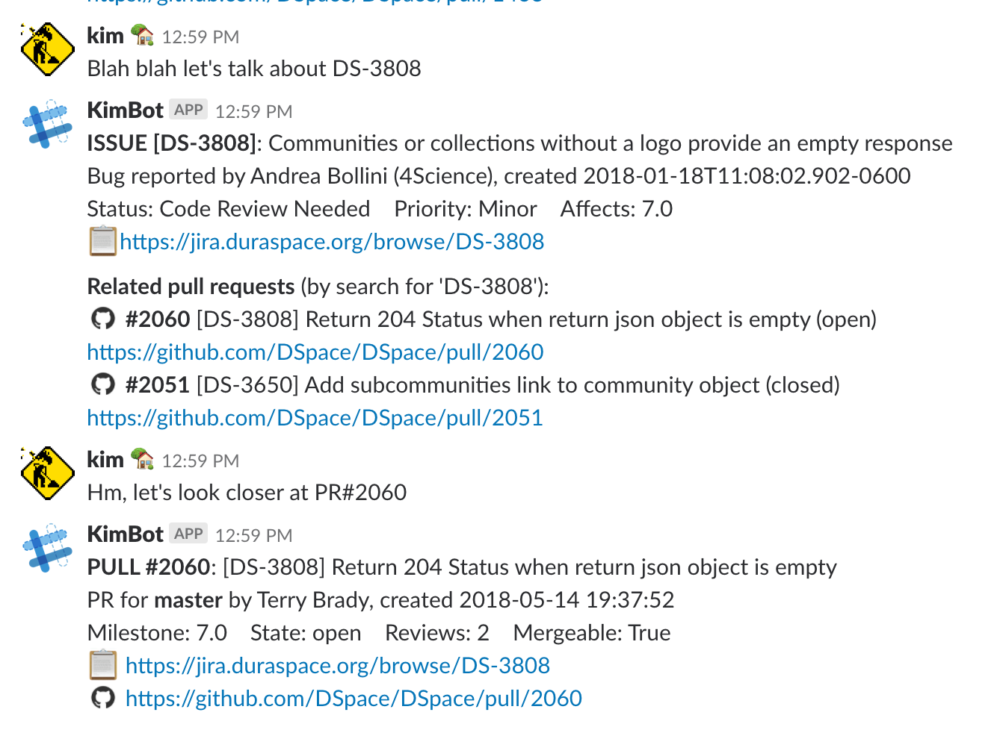

# DSpace Bot
(a prototype)

This is a simple Python bot using clients for the Slack API, Github (v2) API, and JIRA API to provide some useful features to devs and users in the DSpace slack channels, when they're mentioning or querying particular issues or code pieces.

It's currently in prototype form! But it works well. To use it, you will need API keys for all the services mentioned and add this as an app to your Slack project.

The initial version of this bot was based on methods described in an article at https://www.fullstackpython.com/blog/build-first-slack-bot-python.html

## Example

